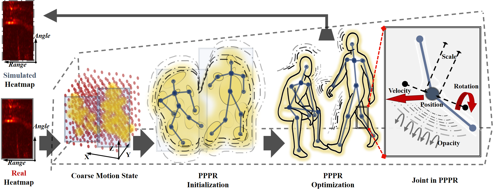

# PPPR: Person Parametric Physics-informed Representation for mmWave-based Human Pose Estimation

<p align="center">
  <a href="https://arxiv.org/abs/2512.23054"></a>
  
  
  
  
</p>

> **Person Parametric Physics-informed Representation for mmWave-based Human Pose Estimation**  
> Shuntian Zheng, Jiaqi Li, Guangming Wang, Minzhe Ni, Arnad Palit, Giovanni Montana, Yu Guan  
> University of Warwick · University of Cambridge  
> [📄 Paper](https://arxiv.org/abs/2512.23054)

---

## Overview


mmWave radar-based Human Pose Estimation (HPE) faces a fundamental **signal-noise dilemma**:

| Input Format | Problem |
|---|---|
| **Heatmap** | Retains human reflections but embeds heavy environmental clutter |
| **Point Cloud (PC)** | Suppresses noise but discards informative human reflections |

We propose **PPPR (Person Parametric Physics-informed Representation)**, a physics-informed parametric intermediate representation that models each human joint as a **Gaussian primitive** encoding both:
- **Kinematic properties**: position, velocity, orientation
- **Electromagnetic properties**: scattering intensity, Doppler signature

PPPR is optimized via **MmWave Human Parameterization (MHP)**, a differentiable pipeline enforcing dual physics-informed constraints to simultaneously maximize human signal preservation and minimize noise.


---

## Key Results

- **4–10 mm MAJPE reduction** across 4 HPE models on 3 datasets vs. conventional Heatmap/PC inputs
- **Cross-scene**: stable performance across diverse furniture arrangements (< 2 mm std. deviation)
- **Cross-dataset**: 59–61% relative error reduction when transferring across different radar chipsets
- **75% fewer parameters** and **2× faster inference** compared to PC-based baselines
- Compatible with **vision-domain HPE models** (e.g., PoseformerV2) as a plug-and-play input

---

## Method

### PPPR Parameterization

Each joint $j$ is represented as a Gaussian primitive with parameter set $\Theta_j = \{\mathbf{p}_j, \mathbf{s}_j, \mathbf{q}_j, \mathbf{v}_j, \beta_j, \boldsymbol{\omega}_j\}$:

| Parameter | Type | Description |
|---|---|---|
| $\mathbf{p}_j \in \mathbb{R}^3$ | Geometric | 3D joint position |
| $\mathbf{s}_j \in \mathbb{R}^3$ | Geometric | Anisotropic scale |
| $\mathbf{q}_j \in \mathbb{R}^4$ | Geometric | Orientation (quaternion) |
| $\mathbf{v}_j \in \mathbb{R}^3$ | Motion | Instantaneous velocity |
| $\beta_j \in \mathbb{R}$ | Electromagnetic | Radar cross-section opacity |
| $\boldsymbol{\omega}_j \in \mathbb{R}^{N_d}$ | Electromagnetic | Doppler frequency features |

### MmWave Human Parameterization (MHP)

MHP consists of three stages:

1. **Initialization** — Extract coarse joint positions and Doppler-based velocities from the raw Heatmap
2. **Radar Simulation** — Reconstruct a synthetic Heatmap $H_\text{sim}$ via a differentiable electromagnetic forward model ($M_\text{atten}$, $M_\text{range}$, $M_\text{Dopp}$, $M_\text{angle}$)
3. **Dual-Constraint Optimization** — Jointly minimize:
   - **Kinematic loss** $\mathcal{L}_\text{kine}$: bone length consistency, rigid-body motion, joint angle limits
   - **Electromagnetic loss** $\mathcal{L}_\text{EM}$: IoU-based alignment between $H_\text{sim}$ and $H_\text{ori}$

$$\mathcal{L}_\text{total} = w_\text{EM} \mathcal{L}_\text{EM} + w_\text{kine} \mathcal{L}_\text{kine}$$

---

## Installation

```bash
git clone https://github.com/YOUR_USERNAME/PPPR.git
cd PPPR
pip install -r requirements.txt
```

**Requirements**: Python ≥ 3.8, PyTorch ≥ 2.0, CUDA ≥ 11.7 (recommended)

---

## Datasets

We evaluate on three public mmWave HPE datasets. Download and place them under `data/`:

| Dataset | Radar | Heatmap Shape | Download |
|---|---|---|---|
| [MMVR](https://github.com/Fang-Haoshu/MMVR) | TI AWR2243 | 256×128 | [Link](https://github.com/Fang-Haoshu/MMVR) |
| [HuPR](https://github.com/Kumachar/HuPR) | TI IWR1843BOOST | 64×64×8 | [Link](https://github.com/Kumachar/HuPR) |
| [XRF55](https://github.com/aiotgroup/XRF55) | TI IWR6843ISK | 256×128 | [Link](https://github.com/aiotgroup/XRF55) |

Expected directory structure:

```
data/
├── MMVR/
├── HuPR/
└── XRF55/
```

---

## Usage

### Prepare PPPR Representations

```bash
# Generate PPPR for a dataset (e.g., MMVR)
python prepare_pppr.py \
    --dataset MMVR \
    --data_root data/MMVR \
    --output_root data/MMVR_pppr \
    --w_em 0.5 \
    --w_kine 0.5 \
    --n_iter 100
```

### Train HPE Model with PPPR Input

```bash
# Example: train RETR on MMVR with PPPR input
python train.py \
    --model RETR \
    --dataset MMVR \
    --input_type pppr \
    --data_root data/MMVR_pppr \
    --output_dir checkpoints/retr_mmvr_pppr
```

Supported `--input_type` values: `heatmap`, `pc`, `pppr`, `pppr_heatmap`, `pppr_pc`

### Evaluate

```bash
python evaluate.py \
    --model RETR \
    --dataset MMVR \
    --input_type pppr \
    --checkpoint checkpoints/retr_mmvr_pppr/best.pth
```

### Cross-Dataset Evaluation (with Radar Calibration)

```bash
# Train on MMVR, evaluate on XRF55 (different radar chipset)
python evaluate.py \
    --model RETR \
    --train_dataset MMVR \
    --test_dataset XRF55 \
    --input_type pppr \
    --checkpoint checkpoints/retr_mmvr_pppr/best.pth \
    --cross_dataset
```

---

## Supported HPE Models

| Model | Input | Paper |
|---|---|---|
| RETR | Heatmap / PPPR | [NeurIPS 2024](https://arxiv.org/abs/2406.04317) |
| HuprModel | Heatmap / PPPR | [WACV 2023](https://openaccess.thecvf.com/content/WACV2023/papers/Lee_HuPR_A_Benchmark_for_Human_Pose_Estimation_Using_Millimeter_Wave_WACV_2023_paper.pdf) |
| mmDiff | PC / PPPR-PC | [ECCV 2024](https://arxiv.org/abs/2403.03686) |
| PoseformerV2 | PPPR | [CVPR 2023](https://arxiv.org/abs/2303.17472) |

PPPR works as a **plug-and-play input** — no modifications to HPE model architectures are required.

---

## Multi-Person Extension

PPPR supports multi-person HPE via:
- **Person counting**: ETCM-CFAR + DBSCAN + MLP (99.4% weighted accuracy, 850 FPS)
- **Inter-person collision constraints**: centroid separation $\mathcal{L}_\text{sep}$ and joint-level avoidance $\mathcal{L}_\text{coll}$

```bash
python prepare_pppr.py --dataset MMVR --multi_person
```

---

## Citation

If you find this work useful, please cite:

```bibtex
@article{zheng2025person,
  title={Person Parametric Physics-informed Representation for mmWave-based Human Pose Estimation},
  author={Zheng, Shuntian and Li, Jiaqi and Wang, Guangming and Ni, Minzhe and Palit, Arnad and Montana, Giovanni and Guan, Yu},
  journal={arXiv preprint arXiv:2512.23054},
  year={2025}
}
```

---

## License

This project is released under the [MIT License](LICENSE).
